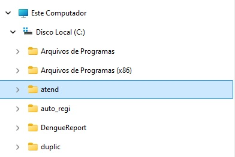
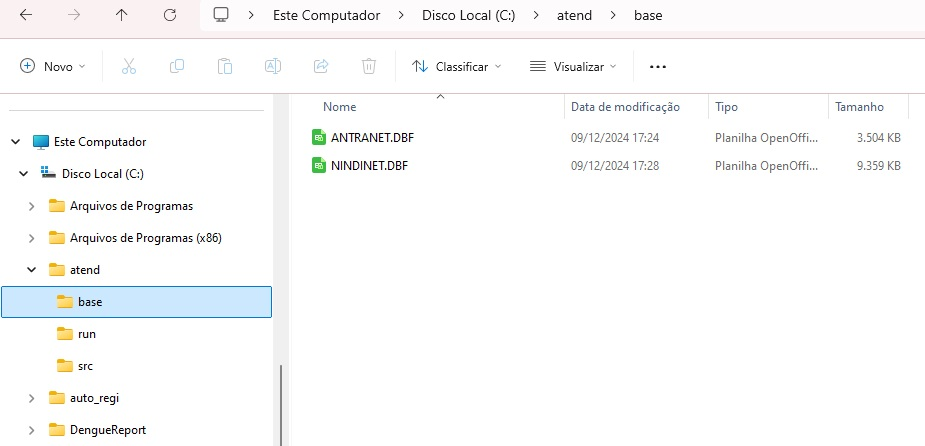

# atend
Identifica notificações de atendimento antirrábico humano sem data de encerramento e que não estejam habilitadas para o fluxo de retorno.

## Como usar?
1. Fazer o download do arquivo "atend.zip" na área de releases (sempre usar o release mais atualizado);  
2. Descompactar o arquivo;  
3. Mover a pasta resultante da descompactação do arquivo (atend), na unidade C ou disco local C;  
  
  
4. Colocar o arquivo de exportação de notificações individuais (nindinet.dbf) e o arquivo de exportação de atendimento antirrábico humano (antranet.dbf) na subpasta "base";
  
  
5. Rodar o arquivo "atend.exe";  
6. O resultado do processamento estará no arquivo "atend.dbf" dentro da subpasta "run".
